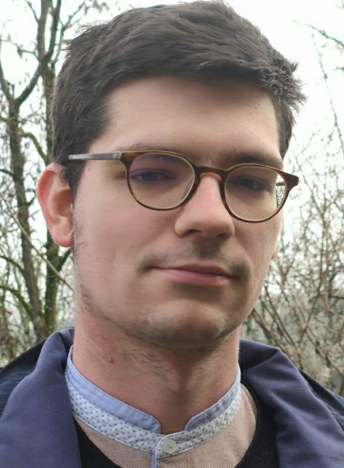

```{r setup, include=FALSE}
knitr::opts_chunk$set(echo = FALSE)

# Learn more about creating websites with Distill at:
# https://rstudio.github.io/distill/website.html

```


<style>
  img {border-radius: 5%}
</style>




# Research Interests

* Uncertainty quantification
* Computational statistics
* Gaussian process regression

# Current and past positions

Since November 2022, I am a research engineer in applied statistics and probability at [CEA](http://www.cea.fr/english/Pages/cea/the-cea-a-key-player-in-technological-research.aspx) (French national laboratory on nuclear and renewable energies).\ 

From November 2019 to November 2022, I was a Ph.D. student in statistics at [CEA](http://www.cea.fr/english/Pages/cea/the-cea-a-key-player-in-technological-research.aspx) 
and [Applied Mathematics Laboratory](https://portail.polytechnique.edu/cmap/en), École polytechnique, under the supervision of [Josselin Garnier](http://josselin-garnier.org), PhD director, and Cyril Feau (CEA, [EMSI](http://www-tamaris.cea.fr/index_en.php)).

# Contact

You can write me an e-mail at: clement "dot" gauchy "at" cea "dot" fr
